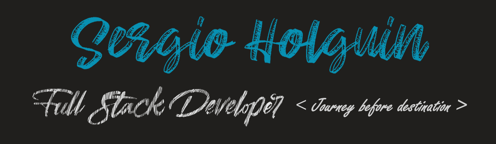

[](https://github.com/sholguinc)

# Hi 👋 I'm Sergio

I'm a junior full stack developer and aspiring illustrator. When I’m not coding I like to draw, design, make some crafts and learn new things.

<div align="center">
  
  [](https://github.com/sholguinc)
  [](https://www.linkedin.com/in/sergio-andr%C3%A9-holgu%C3%ADn-cueva-18016022b/)
  [](mailto:sholguinc@uni.pe)
  
</div>

## 🖌 How I'd define myself

```python
class Sergio(Person):
    def __init__(self):
        self.name = "Sergio Holguín"
        self.age = 22
        self.work = ["Full Stack Developer"]
        self.education = ["Mechatronics Engineering", "National University of Engineering", "Perú"]
        self.hobbies = ["Drawing", "Design", "Crafts", "Reading"]

    def current_location(self):
        return "Lima, Perú"

    def currently(self):
        return {
            "studying": ["Hexagonal Architecture", "OpenAI API"],
            "reading": ["Mitsborn"]
        }
```

## 💻 Technologies I've worked with

<table>
  <thead>
    <tr>
      <th>Frontend</th>
      <th>Backend</th>
      <th>Others</th>
    </tr>
  </thead>
  <tbody>
    <tr>
      <td>
        <p align="left">
          <a href="https://developer.mozilla.org/en-US/docs/Web/JavaScript" target="_blank" rel="noreferrer"></a>
          <a href="https://www.typescriptlang.org/" target="_blank" rel="noreferrer"></a>
          <a href="https://reactjs.org/" target="_blank" rel="noreferrer"></a>
          <a href="https://nextjs.org/docs" target="_blank" rel="noreferrer"></a>
          <a href="https://angular.io/" target="_blank" rel="noreferrer"></a>
          <a href="https://sass-lang.com/" target="_blank" rel="noreferrer"></a>
          <a href="https://tailwindcss.com/" target="_blank" rel="noreferrer"></a>
          <a href="https://getbootstrap.com/" target="_blank" rel="noreferrer"></a>
          <a href="https://vitejs.dev/" target="_blank" rel="noreferrer"></a>
        </p>
      </td>
      <td>
        <p align="left">
          <a href="https://www.python.org/" target="_blank" rel="noreferrer"></a>
          <a href="https://flask.palletsprojects.com/en/2.0.x/" target="_blank" rel="noreferrer"></a>
          <a href="https://www.djangoproject.com/" target="_blank" rel="noreferrer"></a>
          <a href="https://fastapi.tiangolo.com/" target="_blank" rel="noreferrer"></a>
          <a href="https://nodejs.org/en/" target="_blank" rel="noreferrer"></a>
          <a href="https://expressjs.com/" target="_blank" rel="noreferrer"></a>
          <a href="https://docs.nestjs.com/" target="_blank" rel="noreferrer"></a>
          <a href="https://www.ruby-lang.org/en/" target="_blank" rel="noreferrer"></a>
          <a href="https://www.postgresql.org/" target="_blank" rel="noreferrer"></a>
          <a href="https://www.mongodb.com/" target="_blank" rel="noreferrer"></a>
        </p>
      </td>
      <td>
        <p align="left">
          <a href="https://git-scm.com/" target="_blank" rel="noreferrer"></a>
          <a href="https://nodejs.org/en/" target="_blank" rel="noreferrer"></a>
          <a href="https://www.docker.com/" target="_blank" rel="noreferrer"></a>
          <a href="https://www.linux.org" target="_blank" rel="noreferrer"></a>
          <a href="https://www.figma.com/" target="_blank" rel="noreferrer"></a>
        </p>
      </td>
    </tr>
  </tbody>
</table>

## 📈 My GitHub Stats
<div align="center">
  <a href="http://www.github.com/sholguinc">
    
  </a>
  <a href="https://github.com/sholguinc">
    
  </a>
</div>
